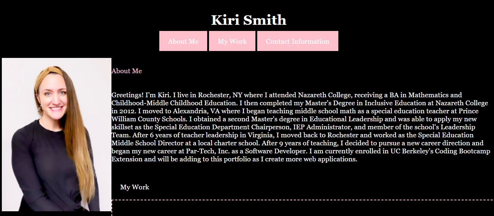

# basic-portfolio

For this project, I created a basic portfolio displaying my contact information, a recent photo, information about me, and links to applications I have deployed.  I needed to build the code from scratch and used an index.html file to store the content of the page and a style.css file to customize the look and styles of the page.  I linked my first application, Code Refactor, to the appropriate section of the "My Work" section and will add the other applications to this pages as they are built and deployed.

## Snapshot

## Built With

* [Visual Studio Code](https://code.visualstudio.com/) - to create and modify the code on my local device
* [HTML](https://developer.mozilla.org/en-US/docs/Web/HTML) - to create elements
* [CSS](https://developer.mozilla.org/en-US/docs/Web/CSS) - to style the html elements
* [Canva](https://www.canva.com/) - to create the "Coming Soon" images for each application
* [Git](https://git-scm.com/) - to track changes and push commits
* [GitHub](github.com) - to host the repository and deploy with GitHub pages

## Deployed Link

* [https://kiri-smith.github.io/basic-portfolio/](#)

## Author

* Kiri Smith 

- [https://kiri-smith.github.io/](#)
- [https://github.com/kiri-smith](https://github.com/)
- [https://www.linkedin.com/in/kiri-lynne-smith/](https://www.linkedin.com/)

## License

This project is licensed under the MIT License.

## Acknowledgments

* Jerome Chenette: for imparting tips, tricks, and wisdom of coding with my cohort
* My peers for answering questions, pushing me to excel and supporting this journey